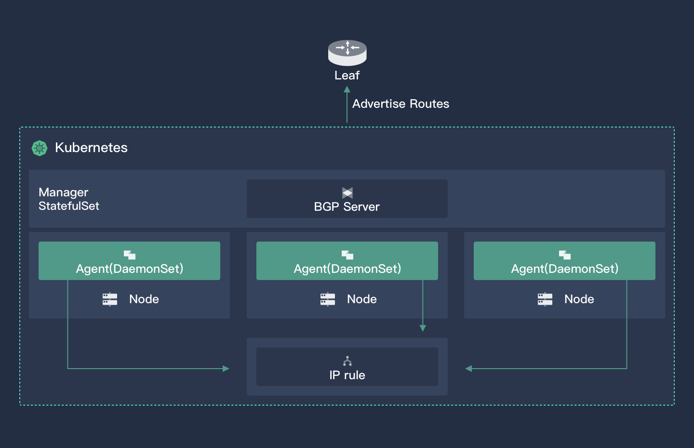

# Porter

`Porter` 是一款适用于物理机部署 Kubernetes 的负载均衡器，该负载均衡器使用物理交换机实现，利用 BGP 和 ECMP 从而达到性能最优和高可用性。我们知道在云上部署的 Kubernetes 环境下，通常云服务厂商会提供 cloud LB 插件暴露 Kubernetes 服务到外网，但在物理机部署环境下由于没有云环境，服务暴露给外网非常不方便，Porter 是一个提供用户在物理环境暴露服务和在云上暴露服务一致性体验的插件。该插件提供两大功能模块：

1. LB controller 和 agent: controller 负责同步 BGP 路由到物理交换机；agent 以 DaemonSet 方式部署到节点上负责维护引流规则；
2. EIP service，包括 EIP pool 管理和 EIP controller，controller 会负责更新服务的 EIP 信息。

Porter 是 [KubeSphere](https://kubesphere.io/) 的一个子项目。

## 物理部署架构

下图是物理部署架构图，假设有一个服务部署在 node1 (192.168.0.2) 和 node2 (192.168.0.6) 上，需要通过公网 IP 1.1.1.1 访问该服务，服务部署人员按照[示例](config/sample/service.yaml)部署该服务后，Porter 会自动同步路由信息到 leaf 交换机，进而同步到 spine，border 交换机，互联网用户就可以通过 EIP 1.1.1.1 直接访问该服务了。

## 插件部署架构
插件通过一个`Manager`监控集群中的Service的变化，广播相关路由。同时集群中所有节点都部署有一个Agent，每当有一个EIP被使用时，就会在主机上添加一个主机路由规则，将发完这个EIP的IP报文引流到本地。

## 插件逻辑

该插件以服务的形式部署在 Kubernetes 集群中时，会与集群的边界路由器（三层交换机）建立 BGP 连接。每当集群中创建了带有特定注记（一个 annotation 为 lb.kubesphere.io/v1apha1: porter，见[示例](config/sample/service.yaml)）的服务时，就会为该服务动态分配 EIP (用户也可以自己指定 EIP)，LB controller 创建路由，并通过 BGP 将路由传导到公网（私网）中，使得外部能够访问这个服务。

Porter LB controller 是基于 [Kubernetes controller runtime](https://github.com/kubernetes-sigs/controller-runtime) 实现的 custom controller，通过 watch service 的变化自动变更路由信息。

## 部署插件

1. [在物理部署的 k8s 集群上部署](doc/deploy_baremetal.md)
2. [在青云上用模拟路由器的方式测试](doc/simulate_with_bird.md)

## 从代码构建新的插件

### 软件需求

1. go 1.11，插件使用了 [gobgp](https://github.com/osrg/gobgp) 创建 BGP 服务端，gobgp 需要 go 1.11
2. docker，无版本限制
3. kustomize，插件使用了 [kustomize](https://github.com/kubernetes-sigs/kustomize/blob/master/docs/INSTALL.md) 动态生成集群所需的 k8s yaml 文件
4. 如果插件会推送到远端私有仓库，需要提前执行 `docker login`

### 步骤

1. `git clone https://github.com/kubesphere/porter.git`, 进入代码目录 
2. `dep ensure --vendor-only`拉取依赖
3. 按照上面教程的要求修改 config.toml (位于 `config/bgp/` 下） 
4. （optional）根据自己需要修改代码
5. （optional）根据自己的需求修改镜像的参数（位于 `config/manager` 下）
6. 修改 Makefile中 的 IMG 名称，然后 `make release`，最终的 yaml 文件在 `deploy` 目录下
7. `kubectl apply -f deploy/release.yaml` 部署插件

## 开源许可

**Porter** is licensed under the Apache License, Version 2.0. See [LICENSE](./LICENSE) for the full license text.